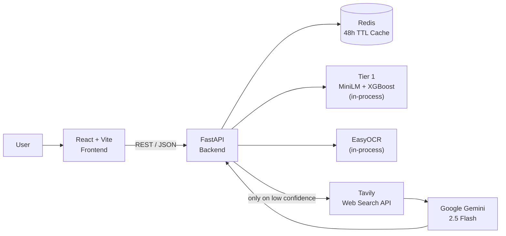
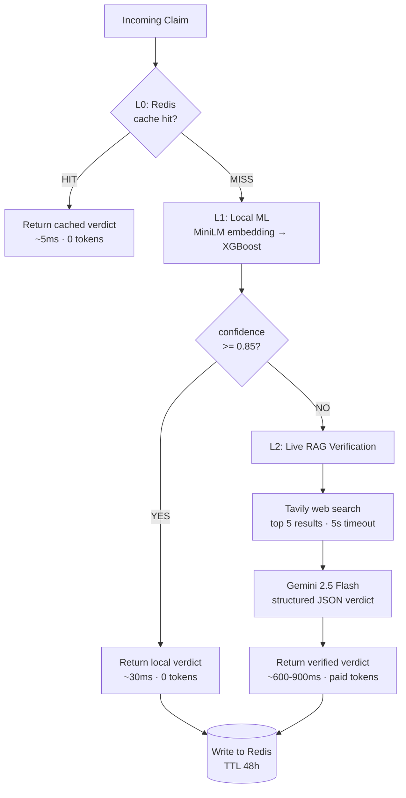
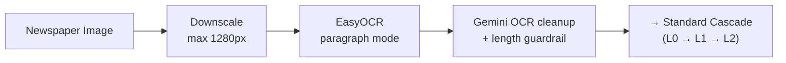

# PressIQ

**AI-Powered Hybrid Fake News Detection & Verification Engine**

PressIQ is a full-stack news verification system that analyzes text claims, headlines, and newspaper images. It combines local ML, OCR, Redis caching, live web search, and an LLM into a single cost-aware pipeline.

The core idea in one line:

> **Check the cache first. Then check locally. Only pay for live web search + Gemini when the local model is genuinely uncertain.**

---

## 1. Problem Statement

Fake news verification has a fundamental cost/latency problem:

- **Naive approach:** send every claim to an LLM with web search. Accurate, but ~1 second latency and a paid API call on *every single request* — including repeat requests for the same viral headline.
- **Pure local ML:** fast and free, but a model trained on a static dataset cannot verify claims about events that happened after training. It has no notion of ground truth.

PressIQ resolves this with a **confidence-based cascade**: a cheap local classifier handles the easy majority of traffic, and expensive live verification is reserved for the uncertain minority.

### Requirements

**Functional**
- Classify a text claim as REAL or FAKE with a confidence score
- Accept newspaper/screenshot images and extract the claim via OCR
- Provide an on-demand, evidence-backed explanation with cited live sources
- Return structured JSON

**Non-Functional**
- Minimize per-request cost (LLM tokens are the dominant cost driver)
- Low latency on the common path
- Degrade gracefully when external dependencies fail
- Be observable: every response reports which path served it, its latency, and its token cost

---

## 2. High-Level Architecture



**Key architectural property:** the ML model, the OCR engine, and the cache lookup all run *inside* the API process or on the local network. The only calls that leave the datacenter — Tavily and Gemini — are gated behind a confidence check. That gate is the entire design.

---

## 3. The Cascade — Request Lifecycle

This is the heart of the system. A request falls through three layers, and **stops at the first one that can answer it**.



### Layer breakdown

| Layer | Component | Latency | Cost | Purpose |
|---|---|---|---|---|
| **L0** | Redis cache | ~5 ms | Free | Absorb repeat traffic on viral claims |
| **L1** | MiniLM + XGBoost | ~30 ms | Free | Handle the confident majority locally |
| **L2** | Tavily + Gemini | ~600–900 ms | Paid | Ground-truth check for uncertain claims |

### Why cache *before* the model, not after?

A cache hit costs ~5 ms and zero CPU. Running the local model first would burn embedding + inference compute on every request before discovering the answer was already known. Cheapest check always goes first — this is the standard cache-aside ordering.

### Why 0.85 as the threshold?

It is the tuning knob that trades **cost against accuracy**:

- **Raise it → more accurate, more expensive.** More requests are deemed "uncertain" and escalate to paid Tier 2 verification.
- **Lower it → cheaper, riskier.** More requests are answered by a local model that may be confidently wrong.

0.85 was chosen so that the local model only auto-answers when it is strongly decisive, while the ambiguous middle band gets real evidence. **This is the single most interesting number in the system — expect to be asked to justify it.**

---

## 4. Image / OCR Pipeline

Images converge into the exact same cascade — OCR is a preprocessing stage, not a separate path.



Two design details worth calling out in an interview:

**1. Downscaling before OCR.** Images are capped at 1280px on the longest edge before hitting EasyOCR. OCR cost scales with pixel count, and newspaper text remains legible at that resolution — a cheap, large latency win.

**2. The OCR cleanup guardrail.** Raw OCR output is noisy (broken words, merged columns), so it is passed through Gemini for correction. But an LLM asked to "clean" text will sometimes *summarize* it instead — destroying the claim. So the output is validated: **if the cleaned text is shorter than 40% of the input, the LLM result is discarded and the raw OCR text is used instead.**

This is a good example of a general principle: *never trust an LLM's output shape without validating it.* The guardrail converts a silent correctness failure into a safe fallback.

---

## 5. Caching Design

```
Key:   "{prefix}:{sha256(normalized_text)}"
       prefix ∈ { analyze, analyze_image, explain }
Value: the full verdict JSON
TTL:   172800s (48 hours)
```

**Normalization** — text is lowercased, trimmed, and internal whitespace collapsed before hashing. This makes the cache resilient to trivial formatting differences.

**Why hash the text instead of using it as the key?** Claims are arbitrarily long and contain characters awkward for keys; SHA-256 gives a fixed-size, safe, uniformly-distributed key.

**Why 48 hours?** A correctness-vs-reuse tradeoff. News develops — a claim that is unverified today may be confirmed tomorrow, so verdicts must not be cached forever. 48h is long enough to absorb a viral news cycle (where the same headline is checked thousands of times) but short enough that verdicts stay fresh.

**Known limitation — exact match only.** The cache keys on a hash, so it only hits on *textually identical* claims. A paraphrase of a cached claim misses entirely. The natural upgrade is a **semantic cache**: embed the claim (the MiniLM encoder is already loaded), do a vector similarity search, and treat >0.95 cosine similarity as a hit. Redis supports vector search natively. *Expect this exact question — "what if someone rewords the claim?"*

**Cache hits are annotated,** not returned raw: `verified_by` is overwritten to indicate a cache hit and `token_usage` is explicitly zeroed, so cost reporting stays honest.

---

## 6. Failure Modes & Graceful Degradation

The system is designed so that no external dependency is load-bearing.

| Failure | Behavior |
|---|---|
| **Redis down** | Connection error is caught at startup; `redis_client` set to `None`. Every cache call short-circuits and the system runs cache-less. Slower and more expensive, **but fully functional.** |
| **Tavily / Gemini down or timing out** | Tier 2 returns `UNVERIFIED`. The system **falls back to the Tier 1 local prediction** rather than erroring — labelled `"Tier 2 Timeout / Tier 1 Safety Net"` so the degradation is visible in the response. |
| **API keys missing** | Clients initialize to `None`; Tier 2 is skipped entirely and Tier 1 always answers. |
| **Tavily returns no results** | The LLM is given `"No direct reporting found."` as context rather than an empty string, so it reasons about *absence of evidence* explicitly. |
| **Tavily slow** | Hard 5-second timeout via `asyncio.wait_for` bounds worst-case latency. |

**The pattern:** every external dependency is optional, and every degradation is *reported in the response* rather than hidden. A user always gets an answer; the `verified_by` field tells them how much to trust it.

---

## 7. Cost Model

Cost is dominated by Gemini tokens, so the metric that matters is **what fraction of traffic reaches Tier 2.**

```
Total cost ≈ (requests reaching L2) × (cost per Gemini call)
```

Three execution paths and their economics:

| Path | Condition | External API calls |
|---|---|---|
| **Cached** | Claim seen in last 48h | 0 |
| **Fast** | Cache miss, local confidence ≥ 0.85 | 0 |
| **Verification** | Cache miss **and** low confidence | 1 Tavily + 1 Gemini |

Two multiplicative filters sit in front of the paid path — the cache absorbs repeats, and the local model absorbs confident cases. Only claims that are *both novel and ambiguous* cost money.

**Additional token optimizations in the code:**
- `thinking_budget=0` on the Tier 2 verdict call — disables Gemini's extended reasoning, which is unnecessary for a binary REAL/FAKE decision and would otherwise consume significant tokens
- Search result context is truncated to 180 chars per result (5 results) to bound the prompt size
- `response_mime_type="application/json"` forces structured output instead of prose, reducing output tokens
- The cheaper `gemini-2.5-flash-lite` model is used for the explanation endpoint
- Explanations are **on-demand only** — generated when the user explicitly clicks, not eagerly on every verdict

---

## 8. API Reference

### `GET /`
Health check. Returns service status and whether Redis is connected.

```json
{ "status": "online", "redis_connected": true }
```

### `POST /analyze`
Analyze a text claim through the full cascade.

```json
// Request
{ "text": "FSSAI directs discontinuation of misleading labels." }

// Response
{
  "prediction": "REAL",
  "confidence_score": 0.892,
  "verified_by": "RAG Web Check (Gemini + Tavily)",
  "can_explain": true,
  "token_usage": { "prompt_tokens": 412, "candidates_tokens": 8, "total_tokens": 420 },
  "cached": false,
  "latency_ms": 1120.45
}
```

The `verified_by` field is the observability hook — it names which layer produced the verdict (`Redis Cache`, `Local Model (High Certainty)`, `RAG Web Check`, or `Tier 2 Timeout / Tier 1 Safety Net`).

### `POST /analyze-image`
`multipart/form-data` with a `file` field. Runs OCR → cleanup → cascade. Response matches `/analyze` plus an `extracted_text` field showing what the OCR read.

### `POST /explain`
Generates an evidence-backed explanation with cited live source URLs. Deliberately instructed *not* to re-issue a verdict — it explains the existing one, keeping the classification and explanation responsibilities separate.

---

## 9. Tech Stack

| Layer | Technology | Rationale |
|---|---|---|
| Backend | FastAPI (Python), Uvicorn | Native async — essential since the request path is I/O-bound on Redis/Tavily/Gemini |
| Embeddings | SentenceTransformers `all-MiniLM-L6-v2` | 384-dim, small enough to run on CPU in milliseconds |
| Classifier | XGBoost | Strong on dense tabular/embedding features; fast inference |
| OCR | EasyOCR + Pillow | CPU-only deployment, no GPU dependency |
| LLM | Google Gemini 2.5 Flash / Flash-Lite | Low latency, structured JSON output, cheap per token |
| Web Search | Tavily | Search API purpose-built for LLM/RAG context retrieval |
| Cache | Redis (async client) | Sub-ms lookups, native TTL support |
| Frontend | React 19, Vite, Tailwind CSS | — |
| Deployment | Docker, docker-compose, Nginx | Nginx reverse-proxies to the backend with `least_conn` balancing |

---

## 10. Scaling Path

How this evolves from a single container to real traffic:

**1. Horizontal scaling.** The FastAPI backend is stateless — all state lives in Redis. Scale by running N replicas behind the existing Nginx load balancer. The constraint is memory: each replica loads its own copy of MiniLM, XGBoost, and EasyOCR into RAM.

**2. Separate the ML workers.** Model loading is slow and memory-heavy, while the API layer is thin. Splitting inference into a dedicated service lets the two scale independently and drops API cold-start time significantly.

**3. Semantic caching.** As described in §5 — the single highest-leverage cost optimization remaining, since it converts paraphrase misses into hits.

**4. Async job queue for images.** OCR is CPU-bound and slow relative to text analysis. Under load it should move to a Celery/RQ worker pool with the client polling for results, so image uploads cannot starve the fast text path.

**5. Batch the embeddings.** Under concurrent load, micro-batching encode calls yields much better throughput than one-at-a-time inference.

---

## 11. Known Limitations

Stated honestly — being able to critique your own system is usually the point of the question.

- **No authentication or rate limiting.** The endpoints are public and proxy paid APIs, so there is currently no protection against abuse driving up cost. This is the highest-priority gap.
- **Exact-match caching only** — paraphrased claims miss the cache (§5).
- **Tier 1 is only as good as its training data.** A static classifier cannot reason about events after its training cutoff; this is precisely why Tier 2 exists, but a *confidently wrong* Tier 1 prediction above threshold never reaches Tier 2 and is returned as-is.
- **Ambiguous LLM output defaults to FAKE.** If Gemini returns an unparseable verdict, the code falls back to `"FAKE"` rather than `"UNVERIFIED"` — a bias that should be corrected.
- **Cold start is slow.** Loading three ML models takes several seconds, during which requests can fail. Needs a readiness gate.
- **Binary classification only.** Real-world claims are frequently partially true; REAL/FAKE has no room for "misleading" or "lacks context."
- **No automated tests or CI.**

---

## 12. Local Setup

```bash
# Backend
pip install -r requirements.txt
uvicorn backend.main:app --reload      # → http://127.0.0.1:8000

# Frontend
cd frontend
npm install
npm run dev                            # → http://localhost:5173
```

The dev server proxies `/api` to `http://127.0.0.1:8000`, so the frontend calls
the backend same-origin and never trips CORS. Point it at a different backend
with `VITE_DEV_API_TARGET`.

Requires a `.env` in the project root:

```env
TAVILY_API_KEY=your_key_here
GEMINI_API_KEY=your_key_here
REDIS_URL=redis://localhost:6379
```

Or run the full stack (frontend + backend + Redis + Nginx):

```bash
docker compose up --build              # → http://localhost
```

Nginx serves the React build at `/` and proxies `/api/*` to FastAPI, so the whole
app is one origin — no CORS involved. If you instead host the frontend somewhere
else, build it with `VITE_API_BASE_URL=https://your-backend` and set
`ALLOWED_ORIGINS=https://your-frontend` on the backend so it emits the matching
`Access-Control-Allow-Origin`.

---

## 13. Interview Cheat Sheet

**The 30-second pitch**

> PressIQ is a fake news verification API built around a three-layer cascade. A Redis cache absorbs repeat claims in about 5 milliseconds. A local MiniLM-plus-XGBoost classifier handles anything it's confident about in around 30 milliseconds, for free. Only claims that are both novel and ambiguous — below an 85% confidence threshold — escalate to live web search plus Gemini, which costs money and takes under a second. The whole design is about keeping expensive calls off the common path, and every response reports which layer served it, so cost and latency are always observable.

**Likely questions and where the answer lives**

| Question | Section |
|---|---|
| Why check the cache before the model? | §3 |
| How did you pick 0.85? What happens if you change it? | §3 |
| What if the user rewords the claim? | §5 — semantic caching |
| Why a 48-hour TTL and not longer? | §5 |
| What happens when Redis / Gemini goes down? | §6 |
| How do you keep LLM costs down? | §7 |
| How does this scale to 100× traffic? | §10 |
| What's wrong with it / what would you fix first? | §11 — lead with auth + rate limiting |

**Themes worth emphasizing**

1. **Cost-aware design.** The cascade exists because LLM calls are the dominant cost; two filters sit in front of the expensive path.
2. **Graceful degradation.** No external dependency is load-bearing — every failure has a fallback, and every fallback is reported rather than hidden.
3. **Validating LLM output.** The OCR length guardrail (§4) shows treating an LLM as an unreliable component that needs its output checked.
4. **Observability.** `verified_by`, `latency_ms`, and `token_usage` on every response mean the system's behavior is measurable in production, not guessed at.
